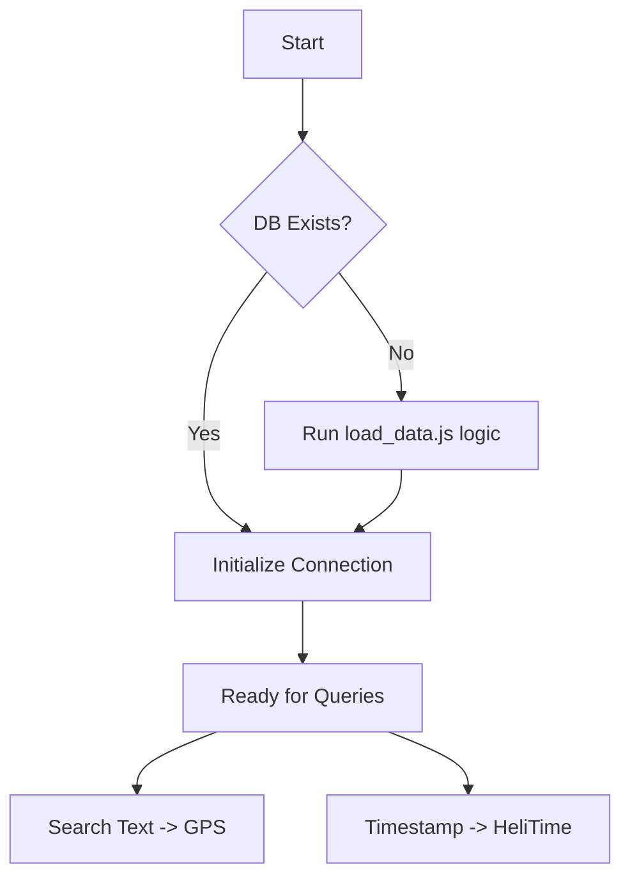

# Implementation Plan - LocationHop Class

This plan outlines the implementation of the `LocationHop` class in [`src/index.js`](src/index.js), which will manage location searches and time conversions using the `HeliCore` engine.

## 1. Architecture Overview

The `LocationHop` class will act as a bridge between the SQLite database (containing city/GPS data) and the `HeliCore` WASM engine.

### Class Structure

```javascript
import { HeliCore } from './heli_engine.js';
// ... other imports

export class LocationHop {
    constructor(dbPath) {
        this.dbPath = dbPath;
        this.db = null;
    }

    /**
     * Ensures database is initialized. 
     * If DB file is missing, it should trigger the load_data.js script logic.
     */
    async init() { ... }

    /**
     * Search for a location by text and return GPS info.
     * Uses FTS5 for performance.
     */
    async search(query) { ... }

    /**
     * Converts a standard timestamp to HeliClock format (orbital degree + zenith).
     */
    async convertToHeliTime(timestamp, lat, lon) {
        const orbital = HeliCore.get_orbital_degree(BigInt(timestamp));
        const zenith = HeliCore.get_zenith_angle(lat, lon, BigInt(timestamp));
        return { orbital, zenith };
    }
}
```

## 2. Database Integration

- **Source Data**: The logic from `../agents/location-hop/scripts/load_data.js` will be used to populate the database if it's empty.
- **Search**: We will use the FTS5 `cities_search` table for fast text-to-GPS lookups.

## 3. HeliClock Integration

- **Engine**: Utilize [`src/heli_engine.js`](src/heli_engine.js) which provides `get_orbital_degree` and `get_zenith_angle`.
- **Use Case**: Converting old time series data into the HeliClock coordinate system.

## 4. Mermaid Workflow



## 5. Next Steps

1.  **Initialize `src/index.js`**: Set up the class skeleton and imports.
2.  **Port DB Logic**: Bring in the `better-sqlite3` logic for searching.
3.  **WASM Binding**: Ensure `HeliCore` is correctly initialized (it's an async WASM module).
